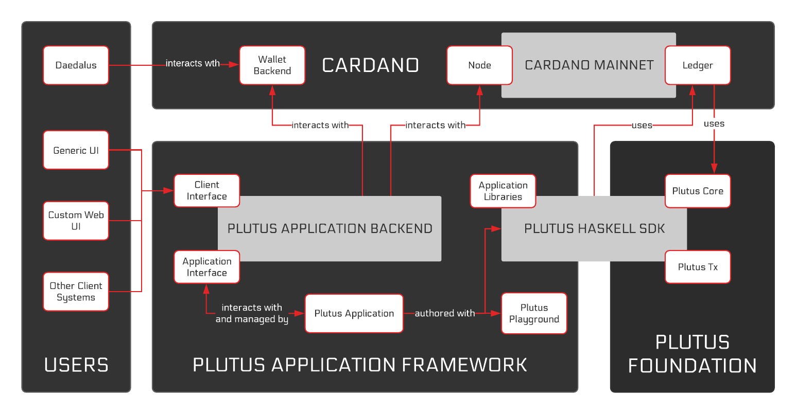

.. _what_is_the_plutus_platform:

Plutus Platform là gì?
============================

Nền tảng Plutus là một nền tảng để viết  *ứng dụng* tương tác với một *sổ cái phân tán* có khả năng *lập trình hay viết kịch bản*, đặc biệt là chuỗi khối :term:`Cardano` blockchain.

Các ứng dụng
------------

Chúng ta đang nói đến loại “ứng dụng” nào ở đây? Hãy nghĩ về một cặp người dùng, Alice và Bob, những người muốn tham gia vào một giao dịch hoán đổi nguyên tử của một số tài sản được lưu trữ trên Cardano.

.. uml::
   :caption: Alice and Bob doing an atomic swap

   actor Alice
   actor Bob
   participant Application
   database Cardano

   Alice -> Application: I want to do an escrowed swap with Bob,\n 50 Ada for my Special Token
   Application -> Ledger: I want to lock up Alice's Special Token so that\n it can only be unlocked if Bob completes the swap
   Ledger -> Application: Ok, that change has settled
   Application -> Bob: Hey, Alice wants to do a swap with you
   Bob -> Application: I want to take up Alice's swap
   Application -> Cardano: I want to spend that locked output with Alice's\n Special Token while sending 50 of Bob's Ada to Alice
   Ledger -> Ledger: Does this transaction satisfy the \nconditions that were asked for? Yes it does!
   Ledger -> Application: Ok, that change has settled
   Application -> Alice: The swap is completed!
   Application -> Bob: The swap is completed!

Alice và Bob không tương tác trực tiếp, cũng không tương tác trực tiếp với sổ cái. Rất ít hệ thống blockchain “thông minh” khuyến khích người dùng của họ tự tương tác trực tiếp với chuỗi, vì điều này thường phức tạp và dễ xảy ra lỗi. Thay vào đó, người dùng tương tác với một số ứng dụng trình bày thế giới dưới dạng mà họ có thể hiểu và tương tác.

Tất nhiên, một ứng dụng như vậy phải muốn làm điều gì đó với sổ cái, nếu không bạn sẽ không cần bất cứ điều gì mới! Các ứng dụng đơn giản có thể không làm gì khác hơn là gửi các giao dịch cơ bản chuyển tài sản - hãy tưởng tượng một ứng dụng “thanh toán thông thường” đơn giản. Tuy nhiên, trọng tâm chính của chúng tôi là các ứng dụng sử dụng các tính năng thông minh để có một nhân mã đáng tin cậy được xác thực như một phần của sổ cái.

Điều này cho phép các ứng dụng không khả thi. Alice và Bob cần logic đáng tin cậy để thực hiện hoán đổi của họ: một ứng dụng “ngu ngốc” có thể gửi các giao dịch chuyển tài sản, nhưng sẽ không có biện pháp nào chống lại việc Bob đào tẩu. Việc sử dụng các tính năng thông minh của sổ cái đảm bảo rằng Bob không thể lấy mã thông báo của Alice trừ khi anh ta thực sự gửi tiền cho cô ấy và nó thực hiện điều này mà không liên quan đến bên thứ ba đáng tin cậy.

Tạo và sử dụng hạt nhân đáng tin cậy của mã là phần khó khăn nhất về mặt kỹ thuật và nhạy cảm về bảo mật trong toàn bộ hoạt động. Tuy nhiên, việc viết phần còn lại của ứng dụng chứa rất nhiều phức tạp. Trong số những thứ khác, một ứng dụng cần phải xử lý phần mềm xung quanh sổ cái (ví, nút, v.v.); các vấn đề về hệ thống phân tán chẳng hạn như sự chậm trễ trong thanh toán, trạng thái không nhất quán giữa các bên và quá trình hoàn trả; và các vấn đề đơn giản về trải nghiệm người dùng như nâng cấp, quản lý trạng thái và đồng bộ hóa. Hơn nữa, mặc dù không có cái nào trong số này là khá quan trọng về bảo mật như hạt nhân đáng tin cậy, nhưng người dùng chắc chắn có thể bị tấn công thông qua các ứng dụng như vậy và ngay cả các lỗi không độc hại cũng có thể khá khó chịu khi tiền của người dùng bị đe dọa.

Ngay cả các ứng dụng đơn giản cũng phải đối phó với sự phức tạp này, và đối với các ứng dụng nâng cao hơn xử lý trạng thái theo thời gian, khó khăn càng tăng lên gấp bội.

Nền tảng Plutus
-------------------

Đây là lý do tại sao Nền tảng Plutus là một nền tảng . Thay vì chỉ cung cấp một vài công cụ để làm cho mức tối thiểu có thể đạt được, chúng tôi hướng tới việc hỗ trợ toàn bộ quá trình phát triển ứng dụng, ngay từ khâu soạn thảo đến kiểm tra, hỗ trợ thời gian chạy và (cuối cùng) xác minh. Cuối cùng, chúng tôi viết nó bởi vì chúng tôi cần bản thân nó để làm bất cứ điều gì hữu ích!

Về mặt khái niệm, Nền tảng chia nhỏ dựa trên phần nào của hệ thống mà chúng tôi quan tâm:

- :ref:`Plutus Foundation<what_is_plutus_foundation>`: hỗ trợ viết hạt nhân đáng tin cậy của mã và thực thi nó trên chuỗi
- `The Plutus Application Framework <https://github.com/input-output-hk/plutus-apps>`_: s hỗ trợ viết ứng dụng (“Ứng dụng Plutus”) theo một phong cách cụ thể

  Một kiến ​​trúc cấp cao của Nền tảng Plutus, tập trung vào các ứng dụng.

Tham khảo thêm
---------------

Nền tảng được giới thiệu trong Peyton Jones và Müller :cite:t:`plutus-platform-summit`.

Thiết kế của nền tảng được thảo luận trong IOHK :cite:t:`plutus-report`.
